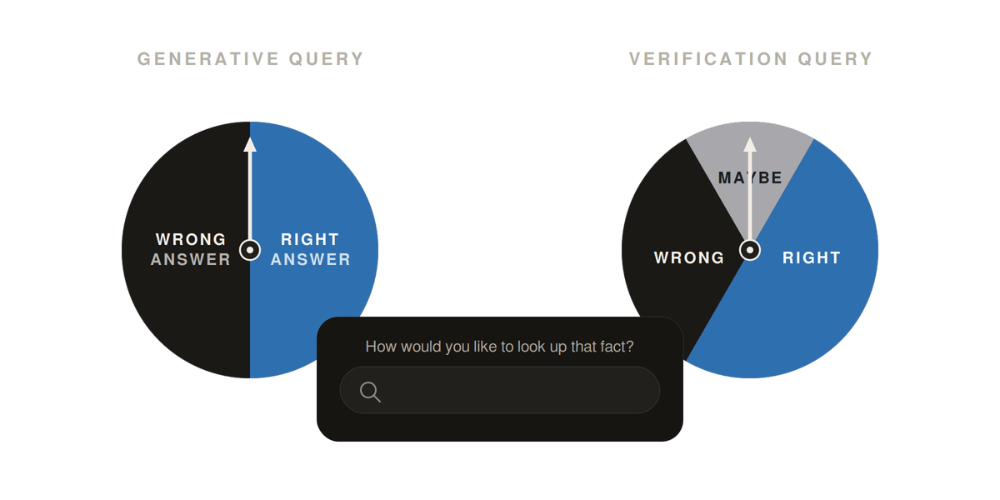

# The Future of Facts:<br>Tracing the Factual Generation-Verification Gap

 

[](https://arxiv.org/abs/2605.27564)
[](https://www.trdavidson.com/fact-gap)

## Overview of repository

This repository provides code for reproducing the experiments from the paper. It is organized into two main sections, with the relevant documentation linked below:

1. Controlled experiments:
    - [Generate synthetic data](src/origins/synthetic_data/README.md)
    - Run controlled experiments (this README)
2. Natural experiments:
    - [Prepare naturalistic data](src/origins/notebooks/natural_experiment_data_prep.ipynb)
    - [Run natural experiments](src/origins/README_natural_experiment.md)

## Installation

The recommended setup is via the pre-built Docker image, available on DockerHub:

```bash
docker pull anjasur/factgap:amd64-cuda-root-latest
```

See the image page on DockerHub [anjasur/factgap](https://hub.docker.com/r/anjasur/factgap/tags).

If you would rather build the image yourself, see the [`Dockerfile`](installation/docker-amd64-cuda/Dockerfile) in the `installation/` folder.

---

## Main entry points for controlled experiments

This README outlines how to run the controlled experiments. All three main scripts (training, inference and grading) are driven by Hydra configs from
`src/origins/configs/`. The config is selected with `--config-name` and any field can be overridden from the command line.


| Script                        | Purpose                                     | Backend                                   | Stage config     |
| ----------------------------- | ------------------------------------------- | ----------------------------------------- | ---------------- |
| `src/origins/main.py`         | Training and loss computation               | `transformers` + `accelerate` (DeepSpeed) | `train.yaml`     |
| `src/origins/main_vllm.py`    | Fast inference over one or more checkpoints | `vLLM`                                    | `inference.yaml` |
| `src/origins/main_grading.py` | Grade model outputs using external LLM APIs | OpenAI / Gemini APIs                      | `grade.yaml`     |


The three stage configs use `default_config.yaml` as a base and override the relevant flags for the chosen stage.

### Quick start (4-GPU node)

##### Train with `accelerate` + Hugging Face:
```bash
accelerate launch --config_file accelerate_configs/train_launch.yaml \
    src/origins/main.py --config-name train
```

##### Run inference with vLLM:
```bash
python3 src/origins/main_vllm.py --config-name inference \
    infer.checkpoint_params.checkpoint_path=outputs/debug/experiment_default_train
```
Point `infer.checkpoint_params.checkpoint_path` at the directory of a previous training run — with default settings this is `outputs/debug/experiment_default_train` (see the [Outputs](#outputs) section for how this path is constructed):

##### Grade model outputs with an external LLM API:
```bash
python3 src/origins/main_grading.py --config-name grade \
    grading.results_dir=outputs/debug/experiment_default_infer
```
Point `grading.results_dir` at the directory of a previous inference run — with default settings this is `outputs/debug/experiment_default_infer`:

Any Hydra override is simply appended to the command:

```bash
python3 src/origins/main_vllm.py --config-name inference \
    infer.checkpoint_params.checkpoint_path=outputs/v12_gemma3_4b/lr1e-5 \
    infer.checkpoint_params.start_epoch=5 \
    infer.checkpoint_params.end_epoch=20
```

### Outputs

Every run of `main.py`, `main_vllm.py`, or `main_grading.py` creates a results directory under `outputs/`. Each invocation creates its own timestamped subdirectory under `hydra.run.dir`, where results, logs and a Hydra config snapshot are written.

Override `output.experiment_group` and `output.experiment_name` to control where results land. The sweep configs generated by `src/origins/prepare_sweeps/prepare_experiments.py` set these automatically per grid point.

---

## Configuring a stage

Each stage — training, inference, grading — has its own stage config in `src/origins/configs/` (`train.yaml`, `inference.yaml`, `grade.yaml`) that:

1. inherits the full schema from `default_config.yaml`, and
2. **overrides the fields needed for that stage** — at minimum the stage flag (`train.enable_training`, `infer.enable_inference`, or `grading.enable_grading`), so exactly one stage is active per run.

The YAML blocks below show, for each stage, the overrides you typically need on top of `default_config.yaml`. Anything not listed inherits its default from `default_config.yaml`.

### Training 
`--config-name train`

Overrides on top of `default_config.yaml` for a training-only run:

```yaml
train:
  enable_training: true            # stage flag — must be true for training
  gradient_checkpointing: false    # set to true if running out of GPU memory
  num_train_epochs: 20             # number of epochs to train for
  learning_rate: 5e-6
  per_device_train_batch_size: 16
  gradient_accumulation_steps: 1   # needs to match the value in the accelerate config
```

### Inference 
`--config-name inference`

Overrides on top of `default_config.yaml` for an inference-only run:

```yaml
train:
  enable_training: false           # stage flag — disable training

infer:
  enable_inference: true           # stage flag — must be true for inference
  temperature: 0.3
  num_return_sequences: 1
  checkpoint_params:
    # Set to outputs/<experiment_group>/<run> from a training job.
    # main_vllm.py loads <checkpoint_path>/model_after_epoch_<i> for each i in
    # [start_epoch, end_epoch] (step `frequency`).
    checkpoint_path: null
    start_epoch: 0
    end_epoch: 20
  frequency: 1
```

### Grading 
`--config-name grade`

`main_grading.py` reads model outputs produced by the inference stage and sends them to an external LLM to be graded.

Create an `api_keys.yaml` file (path configurable via `grading.api_key_file_path`). Each top-level key must be one of the provider strings defined by the `ProviderAPI` enum in `src/origins/models_api/adapters.py`. `main_grading.py` infers the provider from
`grading.model` (or uses `grading.provider` if set) and looks up the matching key here:

```yaml
openai: "sk-..."
google: "AIza-..."
```

Overrides on top of `default_config.yaml` for a grading-only run:

```yaml
train:
  enable_training: false           # stage flag — disable training

grading:
  enable_grading: true                            # stage flag — must be true for grading
  results_dir: outputs/<experiment_group>/<run>   # set to results output folder produced by main_vllm.py
  start_epoch: 0                                  # inclusive
  end_epoch: 20                                   # inclusive
  # Grader model — provider is auto-inferred from the model name; set `provider` to override.
  model: gemini-3.1-flash-lite
  provider: null
  api_key_file_path: "api_keys.yaml"
  # Generation parameters forwarded to the grader LM.
  temperature: 0.3
  max_tokens: 512
  reasoning_effort: minimal                       # none / minimal / low / medium / high
  # Throughput / robustness.
  max_concurrent_requests: 10
  max_retries: 5
  skip_model_lookup: false
  # Jinja2 template for the grader prompt.
  grading_template_name: "api_grading.j2"
  # Quick-check subsets.
  debug_mode: false
  debug_num_samples: 1000
  debug_num_unique_tasks: 50
```

---

## Analysing results

After running the experiments, you can plot the results (generation and verification accuracy) using [`src/origins/notebooks/plot_results.ipynb`](src/origins/notebooks/plot_results.ipynb). 
The notebook contains one section per phase (acquisition / update / continual learning).

---

## Reproducing experiments from the paper

The `experiments/` directory contains the full set of pre-generated configs and launch scripts used in the paper, organised by **phase** and **model**. The three phases map to the following directory prefixes:


| Paper phase                 | Directory prefix | Example                                |
| --------------------------- | ---------------- | -------------------------------------- |
| Acquisition                 | `learn_`*        | `experiments/learn_gemma3_4b/`         |
| Update                      | `update_`*       | `experiments/update_gemma3_4b/`        |
| Continual learning (forget) | `forget_`*       | `experiments/forget_gemma3_4b_epoch6/` |


`forget_`* (continual-learning) recipes carry an extra `_epoch<N>` suffix that controls *when* continual training is launched relative to the acquisition run: `epoch<N>` means the continual phase starts **N epochs after both capabilities — generation and verification — have saturated** during the acquisition run. So `forget_gemma3_4b_epoch0` resumes from the saturation epoch itself, `forget_gemma3_4b_epoch6` resumes 6 epochs later, etc.

> **Continual learning data prerequisite.** Before running any `forget_`* recipe, prepare the Wikipedia T-REx dataset by executing all cells of [`src/origins/notebooks/prepare_continual_training_data.ipynb`](src/origins/notebooks/prepare_continual_training_data.ipynb). The notebook downloads wiki data triplets and writes the resulting files to `data/control_wiki/`, from which the continual-learning training experiments load the data from.

Each parent phase directory in `experiments/` bundles four sub-stages, distinguished by suffix:


| Suffix        | Stage                                | Entry point                                    |
| ------------- | ------------------------------------ | ---------------------------------------------- |
| `_train`      | Training (acquire / update / forget) | `src/origins/main.py` (Accelerate + DeepSpeed) |
| `_infer`      | Per-checkpoint vLLM inference        | `src/origins/main_vllm.py`                     |
| `_grade`      | API-based grading.                   | `src/origins/main_grading.py`                  |
| `_val_target` | Loss calculation                     | `src/origins/main.py`                          |


The parent directory (e.g. `experiments/learn_gemma3_4b/`) chains `_train` → `_infer` in a single `all_jobs.sh`; the `_grade` and `_val_target` stages are launched separately from their own `all_jobs.sh`.

Models covered: `gemma3_{4b,12b}`, `llama32_{3b,11b}`, `qwen3_{4b,14b}`, `msft4_{4b,14b}` (Microsoft Phi-4 models).

### Acquisition (`learn_*`)

Trains the base model from scratch on the synthetic dataset. This is the first phase of the pipeline; update and forget experiments resume from its checkpoints.

```bash
bash experiments/learn_gemma3_4b/all_jobs.sh             # train + infer
bash experiments/learn_gemma3_4b_grade/all_jobs.sh       # grade
bash experiments/learn_gemma3_4b_val_target/all_jobs.sh  # compute loss 
```

### Update (`update_*`)

Continues training from a fixed learn-phase checkpoint on updated datapoints.

```bash
bash experiments/update_gemma3_4b/all_jobs.sh          # train + infer
bash experiments/update_gemma3_4b_grade/all_jobs.sh    # grade
```

### Continual learning (`forget_*_epoch{N}`)

Continues training from a learn-phase checkpoint on an unrelated dataset.

```bash
bash experiments/forget_gemma3_4b_epoch0/all_jobs.sh           # train + infer
bash experiments/forget_gemma3_4b_epoch0_grade/all_jobs.sh     # grade
```

To author new experiments for any of these phases, see [Running new experiments and sweeps](#running-new-experiments-and-sweeps) below.

---

## Development and debugging

```bash
# Multi-GPU with accelerate (set --num_processes to the number of GPUs)
accelerate launch --config_file accelerate_configs/train_launch.yaml \
    --num_processes 4 src/origins/main.py --config-name train

# Any Hydra override can be appended
accelerate launch --config_file accelerate_configs/train_launch.yaml \
    --num_processes 4 src/origins/main.py --config-name train \
    train.per_device_train_batch_size=2
```

When you tweak `gradient_accumulation_steps`, two values must agree at runtime:

- `cfg.train.gradient_accumulation_steps` — the Hydra config consumed inside `main.py`, and
- `accelerator.gradient_accumulation_steps` — the value Accelerate hands to the live `Accelerator`, read from the launcher's Accelerate / DeepSpeed config file (e.g. `accelerate_configs/train_launch.yaml`) and optionally overridden by the `--gradient_accumulation_steps` CLI flag.

---

## Running new experiments and sweeps

For experiments with grids of hyperparameters, define a single sweep YAML under `src/origins/configs/experiments/` and use `src/origins/prepare_sweeps/prepare_experiments.py` to expand it into stage-specific configs and launch scripts.

A sweep file declares the grid under `hydra.sweeper.params`. For example:

```yaml
# @package _global_
defaults:
  - /defaults/train_small
  - _self_

model:
  name: google/gemma-3-4b-it
  attn_implementation: "eager"

train:
  per_device_train_batch_size: 8
  gradient_accumulation_steps: 1

hydra:
  sweeper:
    params:
      train.learning_rate: 1e-7, 1e-6, 1e-5
```

Then expand it:

```bash
python3 src/origins/prepare_sweeps/prepare_experiments.py \
    --sweep_file_path <path_to_sweep_config_file>.yaml \
    --train_num_gpus 4 \
    --infer_num_gpus 4 \
    --train_accelerate_config train_launch
```

This generates four folders under `experiments/`: one for individual train, infer and grade phases and one for paired train & infer.


### Update / forget continuations

Compact "update" and "forget" configs inherit from a learn sweep via
`_learn_config`, `_learn_run_name`, and `_learn_num_epochs`:

```yaml
# @package _global_
_learn_config: /experiments/learn_gemma3_4b
_learn_run_name: learning_rate1e-05    # the learn run to continue from
_learn_num_epochs: 9                   # epoch checkpoint to load

train:
  upd:
    num_update_epochs: 20
  learning_rate: 4e-6
```

The forget recipe is the same shape, plus a `train.forget` block and the dataset to continue on. The `_epoch<N>` suffix in the filename indicates that training resumes from `model_after_epoch_<saturation_epoch + N>`:

```yaml
# @package _global_
_learn_config: /experiments/learn_gemma3_4b
_learn_run_name: learning_rate1e-05
_learn_num_epochs: 9                   # = saturation epoch + N

train:
  learning_rate: 2e-6
  lr_scheduler_type: "cosine"
  forget:
    num_forget_epochs: 50
    num_forget_samples: 5000
```

Running `src/origins/prepare_sweeps/prepare_experiments.py` on an update / forget recipe writes the same folders under `experiments/` as the learn case (e.g. `experiments/update_gemma3_4b{_train,_infer,_grade,}/` for the update recipe above). It resolves the inherited learn config, points the training at the right checkpoint, forces the appropriate phase flags, and ties the matching infer + grade configs to those outputs.

See `src/origins/configs/experiments/EXAMPLE_{learn,update,forget}_gemma3_4b.yaml` for fully worked sweep templates, and [`src/origins/prepare_sweeps/prepare_experiments.sh`](src/origins/prepare_sweeps/prepare_experiments.sh) for the exact `prepare_experiments.py` invocations used to generate every sweep in `experiments/` (including the `--train_accelerate_config train_launch_big` variants for the larger models).

---

## Citation

```bibtex
@article{davidson2026futurefacts,
  title={The Future of Facts: Tracing the Factual Generation-Verification Gap}, 
  author={Tim R. Davidson and Anja Surina and Caglar Gulcehre},
  journal={arXiv preprint arXiv:2605.27564},
  year={2026},
  url={https://arxiv.org/abs/2605.27564}, 
}
```

---

## License and acknowledgements

This project is released under the terms of the [MIT License](LICENSE).

The initial scaffolding was generated from the
[Python Machine Learning Research Template](https://github.com/CLAIRE-Labo/python-ml-research-template).